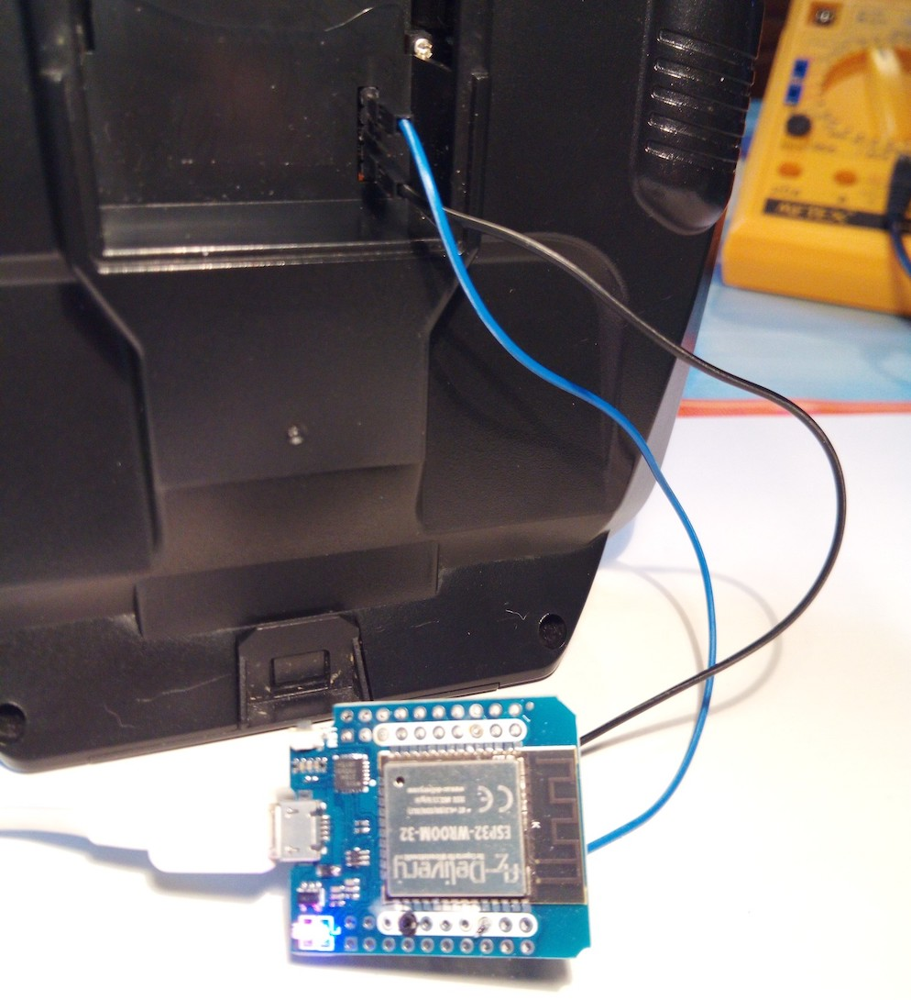
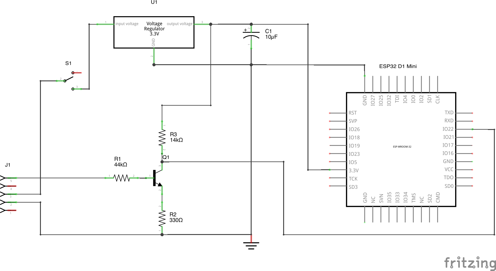
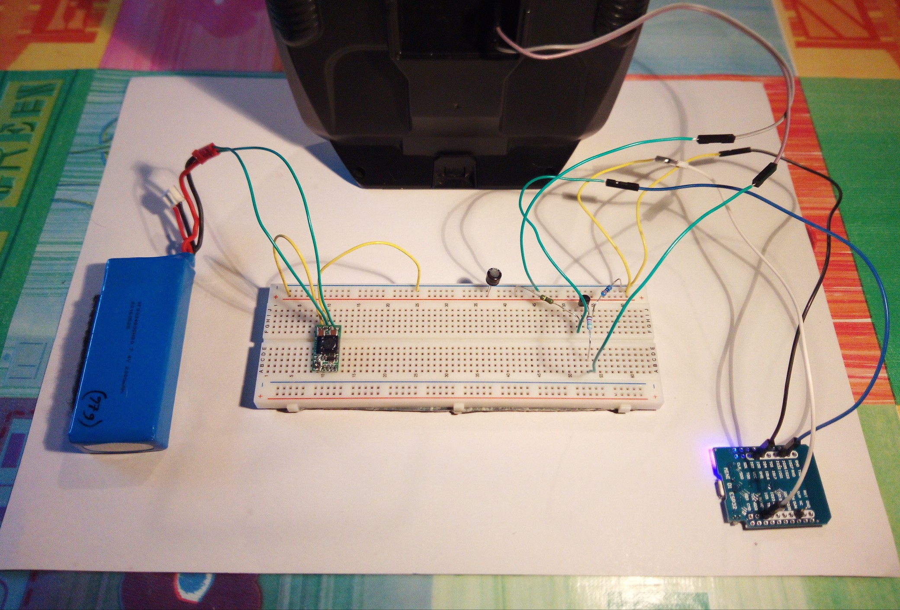
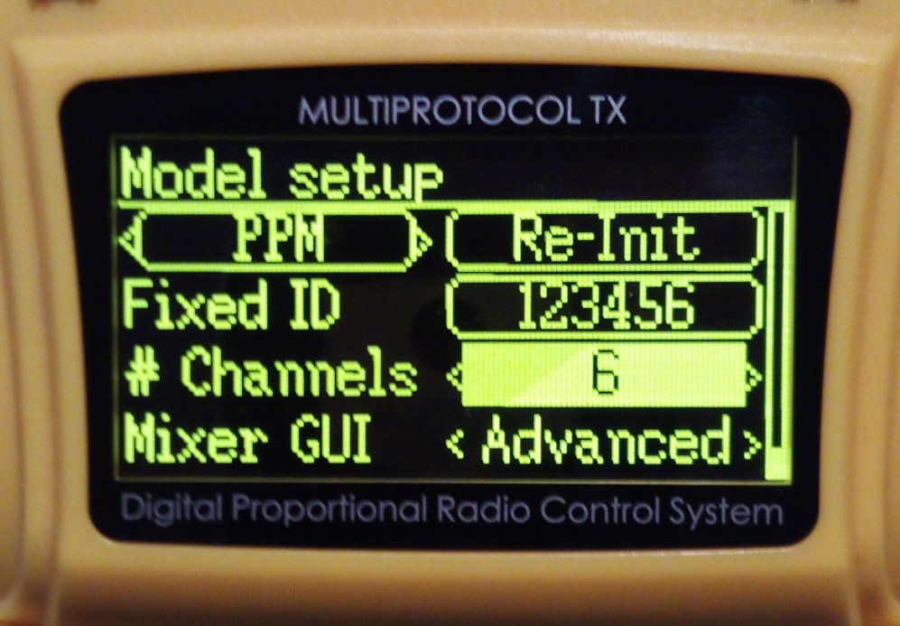
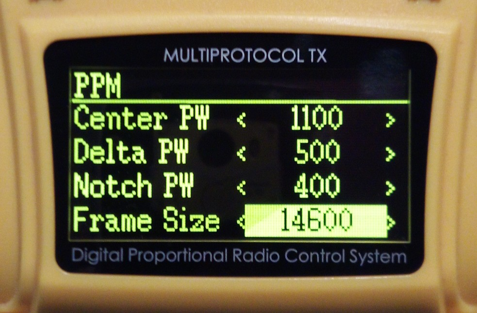
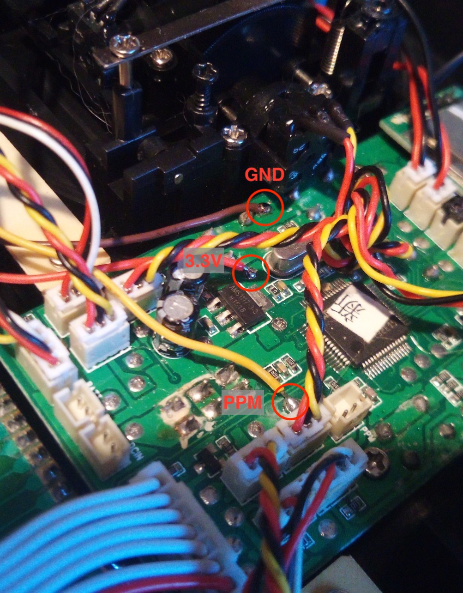

# JR BLE Gamepad
*2021- Fabrizio Sitzia, Sven Busser*

## Introduction

This ESP32 sketch turns your RC transmitter into a generic Bluetooth LE Gamepad, so you can run your favorite RC simulator wirelessly.

The goal was to get rid of any USB-C hubs, dongles, cables, etc. when running an RC simulator on the above laptop, while preserving the low latency and high resolution of a wired USB connection.

A gamepad emulation was chosen because most operating systems and RC sims support them out of the box, without having to install additional drivers.

The yellow transmitter you see on the above photo (a *Jumper T8SG v2 plus*) features a *"JR Module"* bay on the back. In the RC world this is some kind of de-facto standard for extending a transmitter's functionality.

It was a natural choice to try and make this project fit into such a module (which you see on the foreground of the photo). But on transmitters that lack a JR module bay you could still build the circuit directly into the transmitter's housing if it provides a usable PPM signal. An example is given at the end of this document.

By the time of this writing, the module has been tested successfully under Mac OS (Catalina and Big Sur), various Android devices, and Windows 10.

### Highlights

- automatic detection of PPM frame size, up to 12 channels (PPM12)
-  gamepad refresh rate is adjustable on the fly (1Hz-100Hz)
- 16-bit gamepad axis resolution in *high-resolution* mode, 8-bit in *compatibility* mode
- refresh rate & axis resolution can be configured on the transmitter (sacrifices one channel)
- 50 nanoseconds pulse-width sampling resolution (14 bits)
- PPM signal is decoded using the ESP32's RMT hardware
- 30mA average current draw @ 8V using a step-down regulator, 70mA with a linear regulator
- PPM input signal voltage may range from 1V to15V
- performs signal noise threshold estimation for sending gamepad updates only when required

## Building the module

### What you will need

TODO: photo with everything needed

1. ESP32 board  (such as the *ESP32 D1 Mini*) that will fit into a JR module enclosure
2. linear 3.3V regulator or 3.3V step-down buck regulator (latter is preferred to reduce current draw)
3. 10µF electrolytic capacitor
4. 3 resistors (44kΩ, 14kΩ and 330Ω) and a NPN transistor (BC547 or similar)
5. a small piece of stripboard, a few wires, 2 screws
6. 5-pin female connector for interfacing with the module bay pins
7. pin headers to solder the ESP32 board onto the stripboard
8. an on/off switch
9. soldering iron, dremel tool and a glue gun

### Testing the ESP32 board

It is a good idea to first test your ESP32 board before building anything.

Launch the Arduino IDE and edit the main *JR_BLE_Gamepad* sketch: Check if the `LED_PIN` and `PPM_PIN` parameters fit your board, and `#define DEBUG` to have  verbose information appear in the Serial Monitor. Connect the ESP board to the computer's USB port, then compile & upload the sketch.

If all goes well, the following output should appear in the Serial Monitor:

	========================================================
	   JR BLE Gamepad - 2021 Fabrizio Sitzia, Sven Busser   
	========================================================
	
	1. ChannelExtractor: waiting for PPM signal...

You will also notice that the blue onboard LED is now blinking fast, indicating that there is no PPM signal.

**IMPORTANT**: The next steps assume that your transmitter outputs a 3.3 volt PPM signal on pin 5 in the JR module bay.
It is vital to check that the PPM signal voltage does not exceed 3.3V, as higher voltages might damage the ESP32 or even your transmitter. Skip to the next section if that's not the case or if you're unsure!

Use two patch wires to connect the GND (2) and PPM signal (5) pins from your transmitter's module bay to the ESP32 board's GND and `PPM_PIN` (*IO22* by default):

Configure your transmitter to output a PPM signal.

As soon as a PPM signal is detected you should see something like this appearing in the monitor log:

	2. NoiseEstimator: sampling noise...
	   Diff : 1 1 21 21 21 21 
	   Noise threshold (max) = 25
	
	3. GamepadRefresh: axisCount = 6
	   No refresh rate channel: using REFRESH_RATE_DEFAULT = -25
	   Negative refresh rate --> 8-bit gamepad (compatibility mode) @ 25 Hz
	   Waiting for Bluetooth connection...

*Note: Ignore the "rmt error" appearing immediately after this. BLE initialization interferes with RMT, causing a glitch!*

You will notice that the blue LED is now blinking slowly, indicating that there is no Bluetooth connection.

Open the Bluetooth settings on your computer. You should see a device called *JR Gamepad 8*.
Pair the device, and if all goes well the onboard LED will turn a steady blue, and a stream of axis values will appear in the serial monitor:

	-62 -65 196 196 -11468 32767 / 25 Hz
	-65 -127 131 196 -11468 32767 / 25 Hz
	-62 -131 196 262 -11468 32767 / 25 Hz
	-62 -65 196 196 -11468 32767 / 25 Hz
	-65 -65 196 196 -11468 32767 / 25 Hz
	-131 -65 196 196 -11465 32767 / 25 Hz
	-65 -65 196 262 -11468 32767 / 25 Hz
	-65 -65 199 262 -11468 32767 / 25 Hz
	-65 -65 134 196 -11468 32767 / 25 Hz

Those values appear at a slow rate when you are not touching the transmitter's sticks. But as soon as you wiggle the sticks it will jump to the specified refresh rate (25 Hz)

Go ahead and try your RC simulator now ;-)

### Building the circuit on a breadboard

Now build up the following circuit on a breadboard:

The real thing should look a bit like the photo below.

**IMPORTANT**: Never plug in the USB connector when the ESP32 board is being powered by another power source (such as the battery on the photo), as this could damage your board or your computer's USB port!

The purpose of the transistor circuit is to shift a wide range of input PPM signal voltages down or up to 3.3V.

If you had to skip the PPM test in the previous section, you may perform it safely now.

### Soldering the circuit on a stripboard

Those instructions assume that the stripboard circuit is intended to be fit into a Jumper-style "DIY box" that you can either order online, or 3D-print using the model included in this project.

Prepare a piece of stripboard with the following dimensions:

TODO

## Usage & Fine-tuning

The default parameters of this sketch are tuned for maximum compatibility with gamepad drivers, not for maximum performance: They force a fixed 6-axis gamepad with low resolution (8-bit) and a 25Hz refresh rate, which is probably not what you want!

You should therefore modify the *Configurable parameters* in the main `JR_BLE_Gamepad` sketch, as explained in this section.

### Number of channels vs number of gamepads

A standard PPM signal contains 8 channels, which have to be mapped to gamepad axes.

Generic gamepad drivers however support at most 6 axes per gamepad: 4 analog stick axes plus 2 analog trigger buttons.

Therefore, if more than 6 channels are required, they are mapped to a second gamepad. But some gamepad drivers (most notably Android) have trouble dealing with dual gamepad configurations, which is why the default setting is to limit the number of axes to 6.

Another issue with dual gamepad configurations is their support by RC simulators: Even if the gamepad driver properly recognizes two gamepads, your sim may only support a single one.

> The `FORCE_CHANNEL_COUNT` parameter is set to 6 by default, forcing a single gamepad configuration regardless of the number of channels available in the PPM signal.
>
> If you want to use all the PPM channels, then set the `FORCE_CHANNEL_COUNT` parameter to 0 (zero).

### 8-bit vs 16-bit axis resolution

8-bit axis resolution is the norm for your average gamepad that does not feature the high-precision gimbals found in a good RC transmitter.

The USB HID standard (it's the same for Bluetooth) allows specifying 16-bit resolution axes, but not every gamepad driver supports this, which is why the default resolution is 8-bit.

> 8-bit resolution is selected by setting a negative gamepad refresh rate value.
> 16-bit resolution is selected by setting a positive gamepad refresh rate value.
>
> By default `REFRESH_RATE_DEFAULT` is set to -25, resulting in a 25 Hz gamepad refresh rate with 8-bit axis resolution. You can change this value of course, but a more flexible way is to use a refresh rate channel. Read on!

The gamepad refresh rate specifies how often position updates are sent to the computer.

This is a critical setting that varies a lot among gamepad driver implementations: Too low a value and the sticks will feel unresponsive, too high a value and the gamepad driver will have trouble keeping up with the position updates, resulting in stuttering or extreme lag.

You should strive for the highest possible refresh rate that will not overwhelm your gamepad driver.

### The refresh rate channel

The idea behind a refresh rate channel is to use one of the PPM channels to set the gamepad refresh rate.

This will sacrifice one channel, but it will give you a lot more flexibility as you can select 8-bit or 16-bit axis resolution and set the gamepad refresh rate on the fly from your RC transmitter, without having to edit the configuration parameters and re-flash the ESP32 board!

> Set `REFRESH_RATE_CHANNEL` to the number of the channel (1 to max. number of PPM channels) that you want to use as the refresh rate channel.
> Note that the availability of a refresh rate channel overrides `REFRESH_RATE_DEFAULT`.
>
> If you do not want to use a refresh rate channel then set `REFRESH_RATE_CHANNEL` to 0 (zero).

### Gamepad modes

The gamepad refresh rate can be changed on the fly, for example by mapping the refresh rate channel to a rotary knob on your transmitter, or by mapping discrete channel values to different switch positions.

Switching between 8- and 16-bit axis resolutions and between single and dual gamepad modes however affects the structure of the data that is sent via Bluetooth. This means that the module has to be restarted in order for a mode switch to take effect. You may also have to un-pair & re-pair it with the computer!

There are 4 gamepad modes in total:

| Bluetooth name  | res / #ch | Comment                                                 |
| --------------- | ------------------------------------------------------------ | ------------------------------------------------------------ |
| JR Gamepad 8    | 8-bit / 6 | The most compatible, but also the poorest quality mode. Only use it if you have no other choice! |
| JR Gamepad 16   | 16-bit / 6 | Best performance overall if you do not need more than 6 channels. |
| JR Gamepad 2x8  | 8-bit / 12 | Use only if you're stuck with 8-bit and need more than 6 channels. |
| JR Gamepad 2x16 | 16-bit / 12 | The preferred choice if you need more than 6 channels. |

### PPM frame size

A standard 8-channel PPM frame has a length of 22.5 milliseconds, which means that channel values are updated at a 44 Hz rate.

You can improve on this if your transmitter allows you to tweak the PPM signal settings: Only include the channels that you really need, and set a PPM frame size that you calculate using the following formula:

​	*`number of channels * 2 ms + 2.6 ms = frame size in milliseconds`*

The 2.6 ms in the above formula is the minimum sync pulse length plus a little margin (...this sketch allows for shorter sync pulses than the standard 4.6 ms)

As an example, if you only need 6 channels you will get:

​	`6 * 2 ms + 2.6 ms = 14.6 ms`

This equates to a 68 Hz update rate, which is quite an improvement over 44 Hz!

You could reduce the frame size even further by using non-standard channel pulse-widths and a shorter sync pulse length, but this will render the module incompatible with standard PPM signals.

On transmitters runninng the open-source *DeviationTX* firmware, the PPM protocol and the number of channels is configured in the *Model setup* page:

The frame size is defined in the PPM protocol's settings page:

On *DeviationTX* the delta pulse width is set to 400 microseconds by default. Set it to 500 to use the full sampling resolution of this sketch.

### The author's settings

The author's module is configured with `FORCE_CHANNEL_COUNT` set to 0 (zero) and `REFRESH_RATE_CHANNEL` set to 6.

This gives more flexibility when running different RC simulators on different systems: *CGM Next* helicopter sim on Mac OS, *FPV Freerider* quadcopter sim on Mac OS, and the *PicaSim* glider simulation on Android.

Six channels are sufficient for all those simulators and they are mapped as follows:

- The first 4 are used for the stick axes (aileron, elevator, throttle and rudder)
- The 5th channel is used to map additional functions that are put on switches, such as selecting different flight conditions, autorotation, retracting landing gear, etc.
- And the 6th is used as the refresh rate channel.

The Macbook runs at the 100 Hz maximum refresh rate (...because it can ;-)

But different refresh rates and modes have to be used on the Android devices: The *Bqeel Y4 Max* TV box only works reliably in 8-bit mode up to 25 Hz, while the *Blackview Tab 8* tablet works fine in 16-bit mode up to 80 Hz.

Different refresh rate channel values have therefore been mapped to different switch positions on the transmitter, to select the gamepad mode and refresh rate that best fits a particular system.

## Transmitters lacking a module bay

Transmitters that lack a JR module bay can still be turned into a Bluetooth gamepad. The only condition is that they have to provide a usable PPM signal!

The XK X6 that came bundled with the small helicopter that you see along it in the photo, is such a transmitter:

It lacks a module bay, but it does feature a "trainer port" on the back, which typically carries a standard PPM signal:

The best way to find out is to open the transmitter and to actually measure the trainer port signal with an oscilloscope:

And effectively, it turns out to be a standard 8-channel PPM signal with 3.3V amplitude: That signal can be fed directly to an ESP32 input pin - no voltage level-shifting required!

The ESP32 has to be powered with a 3.3V source. You could of course use a separate voltage regulator that you feed from the transmitter's battery, as is done with the JR module.

But in this case, it turns out that we can use the 3.3V regulated power directly from the X6 transmitter's main board:

The X6 transmitter uses a regular AMS1117 3.3V linear voltage regulator that you can see in the center of the photo. That regulator has a 1A max current rating and the transmitter draws 150mA. It will have no problem providing an additional 30mA to the ESP32 board.

The main board features measuring pads which can conveniently be used to solder the GND, 3.3V and PPM wires to the ESP32 board. You see them marked with red circles in the above photo.

Now, as this is intended as a proof-of-concept rather than a definite build, the wires are not directly soldered to the ESP board but to a 3-pin header instead.

They are temporarily patched to the ESP32 as depicted below:

The ESP32 board has been wedged on the left side of the X6 transmitter's casing. For this temporary builld it was the best location for avoiding obstructions to the Bluetooth antenna.

A proper build should include a switch for turning Bluetooth on or off, holes in the transmitter housing for viewing the board's LEDs and accessing its USB port.

TODO: short demo video

## Credits

| To           | For                                                          |
| ------------ | ------------------------------------------------------------ |
| Sven Busser  | the design of the 3D-printed JR module case and for beta-testing on Windows 10 |
| *lemmingdev* | for the Arduino *ESP32-BLE-Gamepad* library (*JR Gamepad* borrows heavily from that code) |
| *chegewara*  | for various ESP32 BLE-related code examples                  |

