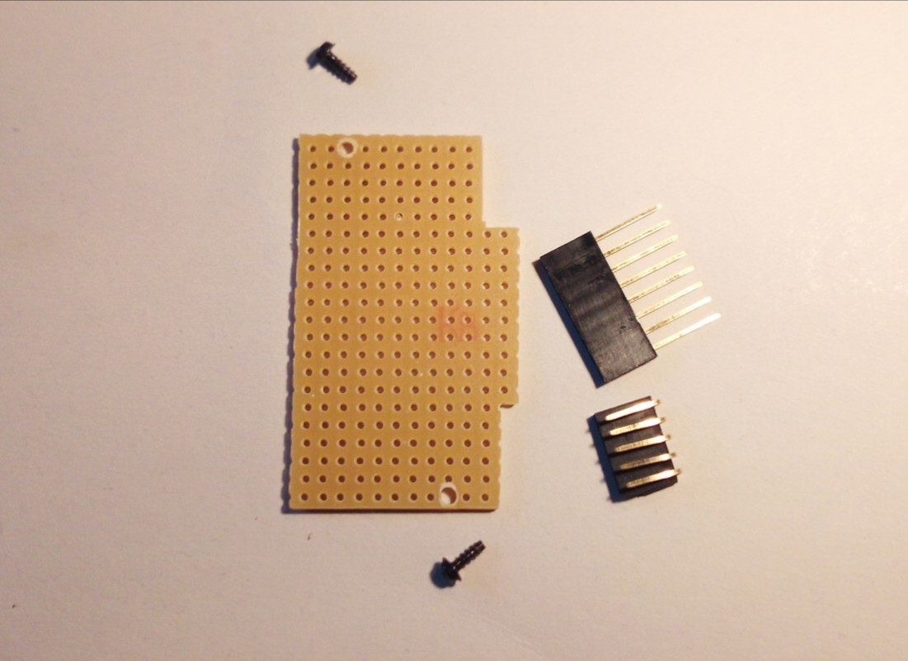
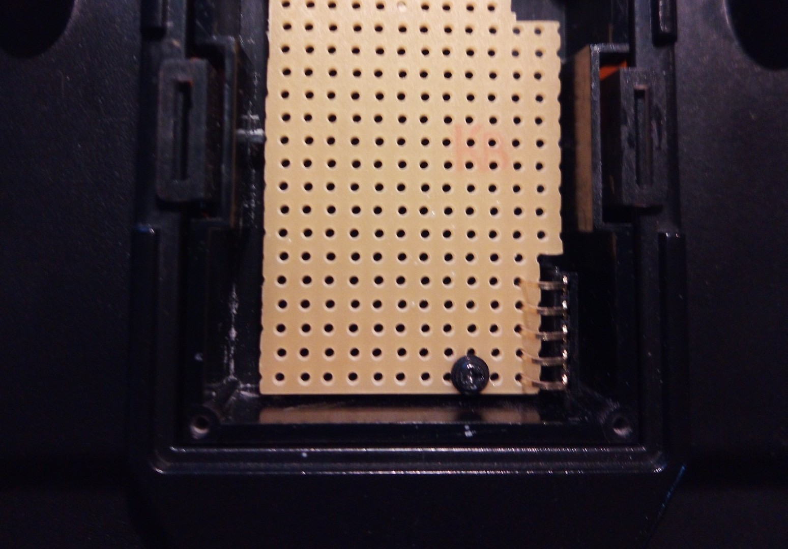

# JR BLE Gamepad
2021- Fabrizio Sitzia 

## Introduction

This ESP32 sketch turns your RC transmitter into a generic Bluetooth LE Gamepad so you can run your favorite RC simulator wirelessly.

Most operating systems and RC simulators support such gamepads out of the box, making it unnecessary to install additional drivers.

The JR module has been targeted towards a *Jumper T8SG v2 Plus* transmitter. The goal was to get rid of any USB-C hubs, dongles, cables, etc. when running a simulator on the laptop, while preserving the low latency and high resolution of a wired USB connection.

By the time of this writing, the module has been tested successfully under Mac OS (Catalina and Big Sur), varios Android flavours and Windows 10.

## Building the JR module

### Testing the ESP32 board

It is a good idea to first test the ESP32 board before building the module.

Launch the Arduino IDE and edit the main `JR_BLE_Gamepad` sketch: Check if the `LED_PIN` and `PPM_PIN` parameters fit your board, and `#define DEBUG` to have  verbose information appear in the Serial Monitor. Connect the ESP board to the computer's USB port, then compile & upload the sketch.

If all goes well, the following output should appear in the Serial Monitor:

	JR BLE Gamepad - 2021 Fabrizio Sitzia
	
	initializing ChannelExtractor: waiting for PPM signal...

You will also notice that the blue onboard LED is now blinking fast, indicating that there is no PPM signal.

The next step assumes that your transmitter outputs a 3.3 volt PPM signal on pin 5 in the JR module bay.
It is **IMPORTANT** to check that the PPM signal voltage does not exceed 3.3V, as higher voltages might damage the ESP32 or even your transmitter!
Skip to the next section if that's not the case.

After ensuring that your transmitter outputs a 3.3V PPM signal, you can use two patch wires to connect the GND and PPM signal pins from your transmitter's module bay to the ESP32 board:

Configure your transmitter to output a PPM signal. You should then see something like this appearing in the monitor log:

	initializing GamepadRefresh & NoiseEstimator tasks
	
	GamepadRefresh: axisCount = 6
	Positive refresh rate --> 16-bit gamepad @ 100 Hz
	NoiseEstimator: sampling noise
	Waiting for Bluetooth connection...
	*****************************************************************************************************
	diff : 1 1 1 20 20 21 
	Noise threshold (max) = 21

You will notice that the blue LED is now blinking slowly, indicating that there is no Bluetooth connection.

Open the Bluetooth settings on your computer. You should see a device called either *JR Gamepad 8*,
*JR Gamepad 16* or *JR Gamepad 2x16* - depending on the number of detected channels and
the value of the refresh rate channel (see Usage section)

Pair the device, and if all goes well the onboard LED will turn a steady blue, and you
should see a stream of axis values appearing in the serial monitor:

	-65 -196 131 199 -32767 32767 / 100 Hz
	-65 -196 131 196 -32767 32767 / 100 Hz
	-131 -196 134 196 -32767 32767 / 100 Hz
	-65 -196 131 196 -32767 32767 / 100 Hz
	-131 -196 131 199 -32767 32767 / 100 Hz
	-65 -196 131 196 -32764 32767 / 100 Hz
	-131 -196 134 196 -32767 32767 / 100 Hz
	-65 -196 131 196 -32767 32767 / 100 Hz
	-131 -196 134 196 -32767 32767 / 100 Hz

Those values will appear at a slow rate when you are not touching the transmitter's sticks, but as soon as you wiggle the sticks the rate will accelerate up to the specified refresh rate (100 Hz in the above output)

Go ahead and run your RC simulator now!

### Testing the circuit on a breadboard

Now build up the entire circuit on a breadboard:

It will look a bit like this:

If in the previous section you had to skip the PPM signal test you can perform that test safely now, as the purpose of the transistor circuit is to shift a wide range of input PPM signal voltages down or up to 3.3V.

### Soldering the circuit on a stripboard

Those instructions assume that the stripboard circuit is intended to be fit into a Jumper-style JR module box that you can either order online, or 3D-print using the model included in this project.

Prepare a piece of stripboard with the following dimensions:

TODO

TODO

## PPM signal

A "standard" PPM signal has the following characteristics:

* It contains a repeating sequence of 9 pulses: 8 channel pulses plus a sync pulse.
* A notch pulse of typically 400 us marks the beginning of a channel pulse.
  That notch pulse is considered to be part of the channel's pulse width.
* The channel's pulse center is expected to be at 1.5 milliseconds, with the pulse
  width varying +/- 0.5 ms, depending on the channel's value.
  A channel pulse thus has a duration of 1 to 2 milliseconds.     
* The 8 channel pulses are followed by a variable length synchronisation pulse.
  A standard sync pulse has a minimal duration of 4.6 ms, and the entire PPM frame
  has a constant width of 22.5 ms. The sync pulse is used to fill the remainder
  of the 22.5 ms PPM frame.
* The channel update frequency of a standard PPM signal is thus 1000 / 22.5 ms = 44.4 Hz

The PPM algorithm of this sketch is of course geared towards the PPM standard, but it
relaxes a number of its constraints, such as the number of channels encoded in a PPM frame
which may vary from 2 to 12 instead of being fixed to 8, the minimal length of a sync pulse
(2.5 ms instead of 4.6 ms) and the fixed PPM frame length of 22.5 ms.

Generic gamepad drivers support at most 6 axes!

Mapping more than 6 channels, while sticking to generic gamepad drivers, is achieved by
declaring a composite HID device with two gamepads.
But then again, how such composite devices are handled largely depends on the particular
host driver implementation: Mac OS for instance makes them appear as a single gamepad
with 12 axes, Android blissfully ignores a second gamepad, and Windows 10, very surprisingly,
actually behaves according to the USB HID standard by presenting 2 gamepads.

It has been developed on an "AZ-Delivery ESP32 D1 Mini" board, but it should run on 

 * any similar ESP32-based board. The D1 Mini was chosen because it fits neatly in a
 * JR module bay enclosure.

## How does it work ?

The sketch constantly extracts the RC channels from the JR module bay's PPM signal. Those channel values are mapped to gamepad axis values, which are packed into a gamepad HID report and sent out via Bluetooth LE.

## Usage

Channel number 6 is used by this JR module to switch into an 8 bit "compatibility" mode
and for dynamically setting the desired gamepad update frequency as follows:

* Negative channel values indicate 8 bit compatibility mode, and positive channel
  values indicate 16 bit mode.
* The absolute (unsigned) channel value specifies the refresh frequency.
  The frequency can be modified on the fly, without restarting the module.
* The compatibility mode is set automatically as soon as a PPM frame is detected.
  Changing the mode later on requires restarting the JR module (Power on/off) and
  un-pairing / re-pairing the module with the host!
  The same applies when switching from less than 6 to more than 6 channels or back,
  as this impacts the structure of the HID report that is sent to the host.
* If the channel number 6 is not available in the PPM signal it is assumed that you
  want to achieve the lowest possible latency / highest possible refresh rate.
  Therefore 16 bit mode with 100 Hz is set as the default.

Immediately after successfull connection with the host, the noise level of each of the
PPM signal's channels is sampled for 1 second.
This is needed for only sending host notifications when required, ie. when a channel's
value changes due to user input, but not due to noise!

The transmitter's sticks should therefore not be moved during the first 3 seconds or so
after connecting to the host.

Some Android devices have issues with 16 bit axis resolution ("Bqeel Y4 Max" TV box),
while others have trouble with refresh rates above 20Hz ("Alldocube M5X S" tablet).
This has nothing to do with CPU performance, as the slowest of the lot (my venerable
"Blackview BV7000 Pro" smartphone) has no issues with 16 bit resolution / 70 Hz!

This prompted the implementation of an 8 bit "compatibility mode" and configurable
refresh rate from the transmitter (by sacrificing one channel), and an algorithm for
sending HID notifications only when a channel value has changed ...but as channel
values fluctuate all the time due to noise, this issue had to be dealt with as well!