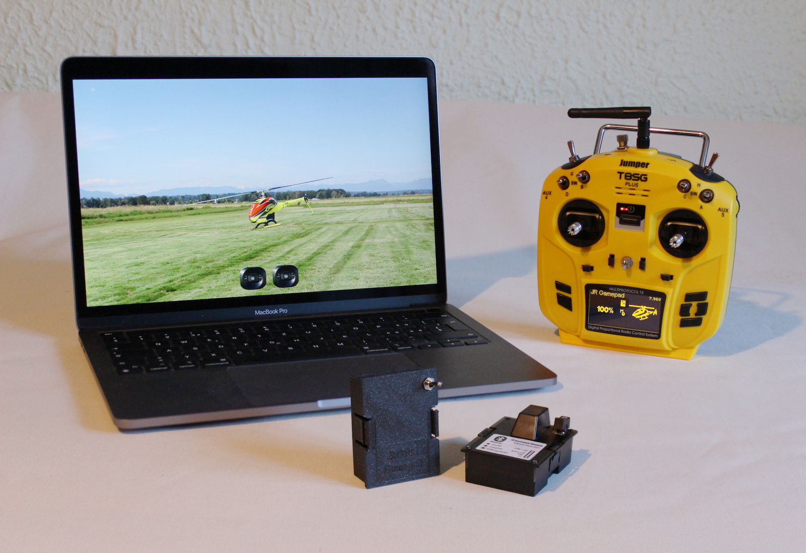
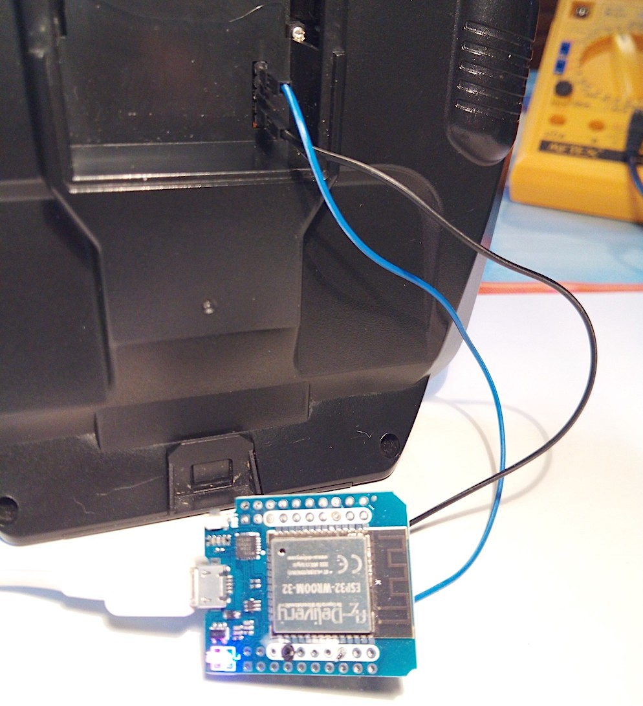
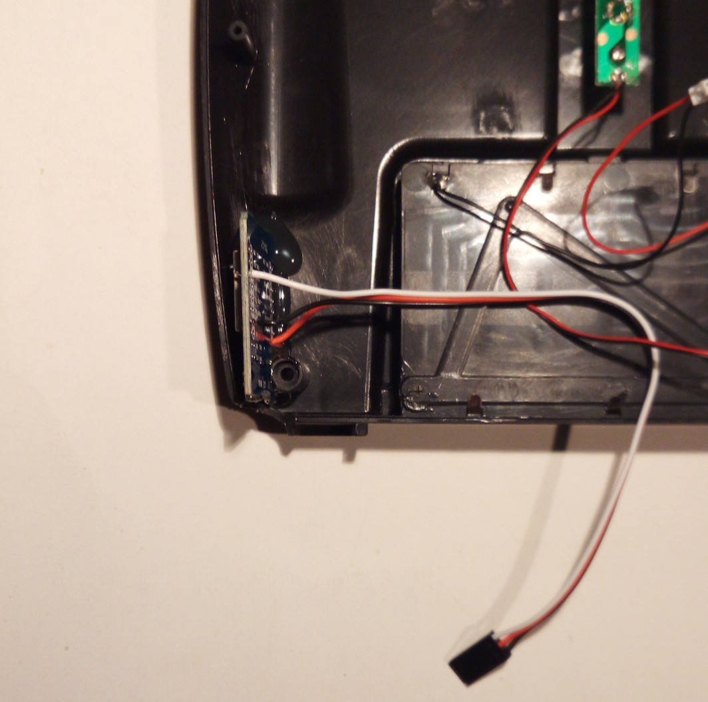

# JR BLE Gamepad
*2021- Fabrizio Sitzia, Sven Busser*

## Introduction

This ESP32 sketch turns your RC transmitter into a generic Bluetooth LE Gamepad. Run your favorite RC simulator wirelessly!

The goal was to get rid of any USB-C hubs, dongles, cables, etc. when running an RC sim on the above laptop, all while preserving the low latency and high resolution of a wired USB connection.

A gamepad emulation was chosen because most operating systems and RC sims support them out of the box, without having to install additional drivers.

The yellow transmitter you see on the above photo (a *Jumper T8SG v2 plus*) features a *"JR Module"* bay on the back. In the RC world this is some kind of de-facto standard for extending a transmitter's functionality.

It was a natural choice to try and make this project fit into such a module. But on transmitters that lack a JR module bay it is still possible to build the circuit directly into the transmitter's housing if a usable PPM signal is available. An example is given at the end of this document.

By the time of this writing, the module has been tested successfully under Mac OS (Catalina and Big Sur), various Android devices, and Windows 10.

### Features

- automatic detection of PPM frame size, up to 12 channels
- gamepad refresh rate & axis resolution adjustable on the transmitter
- 100 nanoseconds, or 13 bit, pulse-width sampling resolution
- 30mA average current draw @ 8V using a step-down regulator, 70mA with a linear regulator
- wide range of PPM input signal voltages (1V to 15V)
- signal noise estimation for differentiating between noise and user input
- compatible with Mac OS, Android and Windows

## Building the module

### What you will need

1. ESP32 board  (such as the *ESP32 D1 Mini*) that will fit into a JR module enclosure
2. 3.3V regulator
3. electrolytic capacitor (6.3V / 47uF)
4. 3 resistors (44kΩ, 14kΩ and 330Ω) and a NPN transistor (BC547, BC337 or similar)
5. a small piece of stripboard
6. a few wires
7. pin headers for soldering the ESP32 board onto the stripboard
8. 5-pin female header for interfacing with the module bay pins
9. 3D-printed module case (or a Jumper-style "DIY box") - STL files are included in this project
10. an on/off switch
11. soldering iron, dremel tool and a hot glue gun

On the software-side you will need the Arduino IDE (https://www.arduino.cc/en/software) with the *"Arduino core for the ESP32"* extension by Espressif. Follow the instructions on https://github.com/espressif/arduino-esp32/blob/master/docs/arduino-ide/boards_manager.md to install it using the *Arduino IDE Boards Manager*.

### Testing the ESP32 board

It is a good idea to first test your ESP32 board before building anything.

Launch the Arduino IDE and edit the main *JR_BLE_Gamepad* sketch: Check if the `LED_PIN` and `PPM_PIN` parameters fit your board, and `#define DEBUG` to have  verbose information appear in the Serial Monitor. Connect the ESP board to the computer's USB port, then compile & upload the sketch.

If all goes well, the following output should appear in the Serial Monitor:

	========================================================
	   JR BLE Gamepad - 2021 Fabrizio Sitzia, Sven Busser   
	========================================================
	
	1. ChannelExtractor: waiting for PPM signal...

You will also notice that the blue onboard LED is now blinking fast, indicating that there is no PPM signal.

**IMPORTANT**: The next steps assume that your transmitter outputs a 3.3 volt PPM signal on pin 5 in the JR module bay. It is vital to check that the PPM signal voltage does not exceed 3.3V, as higher voltages might damage the ESP32 or even your transmitter. Skip this section if that's not the case or if you're unsure!

Use two patch wires to connect the GND (2) and PPM signal (5) pins from your transmitter's module bay to the ESP32 board's GND and `PPM_PIN` (*IO22* by default):

Configure your transmitter to output a PPM signal.

As soon as a PPM signal is detected you should see something like this appearing in the monitor log:

	2. NoiseEstimator: sampling noise...
	   Diff : 1 1 21 21 39 41 
	   Noise threshold (max) = 49
	
	3. GamepadRefresh: axisCount = 6
	   Unity bug workaround under Windows is active
	   No refresh rate channel: using REFRESH_RATE_DEFAULT = -25
	   Negative refresh rate --> 8-bit gamepad (compatibility mode) @ 25 Hz
	   Waiting for Bluetooth connection...

*Note: Ignore any "rmt" errors appearing immediately after this! BLE initialization interferes with RMT, causing a glitch.*

You will notice that the blue LED is now blinking slowly, indicating that there is no Bluetooth connection.

Open the Bluetooth settings on your computer. You should see a device called *JR Gamepad 7*.
Pair the device, and if all goes well the onboard LED will turn a steady blue, and a stream of axis values will appear in the serial monitor:

	63 63 64 64 41 127 / 25 Hz
	63 63 64 64 41 127 / 25 Hz
	63 63 64 64 41 127 / 25 Hz
	63 63 64 64 41 127 / 25 Hz
	63 63 64 64 41 127 / 25 Hz
	63 63 64 64 41 127 / 25 Hz

Those values appear at a slow rate when you are not touching the transmitter's sticks. But as soon as you wiggle the sticks it will jump to the specified refresh rate (25 Hz)

Go ahead and try your RC simulator now ;-)

### Testing the circuit on a breadboard

Now build up the following circuit on a breadboard:

The real thing should look a bit like the photo below.

**IMPORTANT**: Never plug in the USB connector when the ESP32 board is being powered by another power source (such as the transmitter on the photo), as this could damage your board or your computer's USB port!

The purpose of the transistor circuit is to shift a wide range of input PPM signal voltages down or up to 3.3V.

If you had to skip the PPM test in the previous section, you may perform it safely now.

### Building the module

Those instructions assume that the stripboard circuit is intended to be fit into a Jumper-style "DIY box". You may order such a box online, or 3D-print a custom one using the STL files included in this project.

Prepare a piece of stripboard of 33mm x 55mm size (12 x 21 holes), then cut away a 1x5 hole stripe on the bottom right corner to make place for the module bay's 5-pin header, and a 2x4 hole stripe on the top right corner to make place for the on/off switch:

On the photo you also see a female 8-pin header that has been shortened to 5 pins using a dremel. It will be used to interface with the JR module's pin header.

For cutting / joining the traces and for drilling the holes for the screws, refer to the included Fritzing files and to the following picture, which shows a bottom view of the stripboard:

The two black discs are the locations for the screws. They line up exactly with the third hole on the top and bottom rows of the stripboard.

To achieve a perfect fit with the module bay pin header, start by bending the pins 180 degrees and fit them to the stripboard like so:

Drill the holes for the screws and screw the stripboard into the module case.

Plug the case into the transmitter, then plug the female header on top of the module bay's 5-pin header. Bend / adjust the female header pins until they line up exactly with the stripboard holes:

Add a small dab of hot glue to temporarily hold the connector in place until it is soldered to the stripboard.
Let the hot glue set, remove the stripboard from the module case and solder the connector's five pins.

That was the most fiddly part. Soldering the remaining components to the board is easier.
The finished top and bottom sides will look like this:

Notes:

- Only the required 3 pins (and an additional one for increased mechanical stability) have been soldered to the above ESP32 board instead of entire pin-headers. That makes it easier to de-solder the board if necessary.
- Unused stripes are grounded so they act as a ground plane
- The author forgot to join two traces which is why there is one additional wire (...you should not solder stuff after 23 o'clock!)

The final result after fitting the board & on/off switch into the 3D-printed module case:

The module lid clicks onto the base and features a thin translucent plastic layer over the board's LEDs:

*(...picture taken while being distracted by the cat ;-)*

## Usage & fine-tuning

The default parameters of this sketch are tuned for maximum compatibility with gamepad drivers, not for maximum performance!

The defaults force a fixed 6-axis gamepad with low resolution (7 bit) and a 25Hz refresh rate. Your transmitter can do a lot better than that!

You should therefore adjust the *Configurable parameters* in the main `JR_BLE_Gamepad` sketch, as explained in this section.

### Number of channels vs number of gamepads

A standard PPM signal contains 8 channels, which have to be mapped to gamepad axes.

Generic gamepad drivers however support at most 6 axes per gamepad: 4 analog stick axes plus 2 analog trigger buttons.

Therefore, if more than 6 channels are required, they will be mapped to a second gamepad. But some gamepad drivers (most notably Android) have trouble dealing with dual gamepad configurations, which is why the default setting is to limit the number of axes to 6.

Another issue with dual gamepad configurations is their support by RC simulators: The operating system properly recognizing two gamepads is only one part of the equation. A sim that is not limited to a single gamepad is the second part.

> The `FORCE_CHANNEL_COUNT` parameter is set to 6 by default, forcing a single gamepad configuration regardless of the number of channels available in the PPM signal.
>
> If you want to use all the available PPM channels, then set the `FORCE_CHANNEL_COUNT` parameter to 0 (zero).

### 7-, 8-, 15- and 16-bit axis resolutions

8-bit axis resolution is the norm for your average gamepad that does not feature the high-precision gimbals found in a good RC transmitter.

The USB HID standard (it's the same for Bluetooth) allows specifying 16-bit resolution axes, but not every gamepad driver supports this, which is why the default resolution is 8-bit.

Actually, the default resolution is effectively only 7-bit due to a workaround for a Unity engine bug under Windows. Only positive axis values are used when the workaround is enabled, cutting the available resolution in half!

> 8-bit resolution is selected by setting a negative gamepad refresh rate value.
> 16-bit resolution is selected by setting a positive gamepad refresh rate value.
>
> By default `REFRESH_RATE_DEFAULT` is set to -25, resulting in a 25 Hz gamepad refresh rate with 8-bit axis resolution. You can change the default of course, but a more flexible way is to use a *refresh rate channel* as explained later.
>
> If you do not intend to run RC simulators under Windows, you should disable the Unity bug workaround by setting `UNITY_BUG_WORKAROUND` to 0 (zero)
> The effect of the workaround is that only positive axis values are used instead of the full negative to positive value range, thus effectively cutting the axis resolution in half!
>
> While this has no impact in 16-bit *high-resolution* mode (pulse-width sampling resolution is 13-bit) the difference is quite noticeable in 8-bit *compatibility* mode!

### The refresh rate channel

The gamepad refresh rate specifies how often position updates are sent to the computer.

This is a critical setting that varies a lot among gamepad driver implementations: Too low a value and the sticks will feel unresponsive, too high a value and the gamepad driver will have trouble keeping up with the position updates, resulting in stuttering or extreme lag.
You should strive for the highest possible refresh rate that will not overwhelm your gamepad driver.

The idea behind a *refresh rate channel* is to use one of the PPM channels to set the gamepad refresh rate.

This will sacrifice one channel, but it will give you a lot more flexibility as you can select 8-bit or 16-bit axis resolution and set the gamepad refresh rate on the fly from your RC transmitter, without having to edit the configuration parameters and re-flash the ESP32 board!

> Set `REFRESH_RATE_CHANNEL` to the number of the channel that you want to use as the refresh rate channel.
> Note that the availability of a refresh rate channel overrides `REFRESH_RATE_DEFAULT`.
>
> If you do not want to use a refresh rate channel then set `REFRESH_RATE_CHANNEL` to 0 (zero).

### Gamepad modes

The gamepad refresh rate can be changed on the fly, for example by mapping the refresh rate channel to a rotary knob on your transmitter, or by mapping discrete channel values to different switch positions.

Switching between 8- and 16-bit axis resolutions and between single and dual gamepad modes however affects the structure of the data that is sent via Bluetooth (different HID reports) This means that the module has to be restarted in order for a mode switch to take effect. You may also have to un-pair & re-pair the module with the computer afterwards!

There are 8 gamepad modes in total:

| Bluetooth name  | Res / #ch   | Comment                                                      |
| --------------- | ----------- | ------------------------------------------------------------ |
| JR Gamepad 8    | 8-bit / 6   | *Compatibility* mode Necessary on some Android devices. |
| JR Gamepad 16   | 16-bit / 6  | *High-resolution* mode This is the overall best performance mode. |
| JR Gamepad 2x8  | 8-bit / 12  | Use only if you're stuck with 8-bit and need more than 6 channels. |
| JR Gamepad 2x16 | 16-bit / 12 | The preferred choice if you need more than 6 channels.       |
| JR Gamepad 7    | 7-bit / 6   | ...same as the above modes, but with the Unity bug under Windows workaround enabled. Resolution is cut in half, effectively losing 1 bit of precision! |
| JR Gamepad 15   | 15-bit / 6  |                                                              |
| JR Gamepad 2x7  | 7-bit / 12  |                                                              |
| JR Gamepad 2x15 | 15-bit / 12 |                                                              |

### PPM frame size

A standard 8-channel PPM frame has a length of 22.5 milliseconds, which means that channel values are updated at a 44 Hz rate.

You can improve on this if your transmitter allows you to tweak the PPM signal settings: Only include the channels that you really need, and set a PPM frame size that you calculate using the following formula:

​	*`number of channels * 2 ms + 2.6 ms = frame size in milliseconds`*

The 2.6 ms in the above formula is the 2.5 ms minimum sync pulse length plus a little margin (...this sketch allows for shorter sync pulses than the standard 4.6 ms)

As an example, if you only need 6 channels you will get:

​	`6 * 2 ms + 2.6 ms = 14.6 ms`

This equates to a 68 Hz update rate, which is quite an improvement over 44 Hz!

You could reduce the frame size even further by using non-standard channel pulse-widths and a shorter sync pulse length, but this will render the module incompatible with standard PPM signals.

On transmitters runninng the open-source *DeviationTX* firmware, the PPM protocol and the number of channels is configured in the *Model setup* page:

The frame size is defined in the PPM protocol's settings page:

On *DeviationTX* the delta pulse width is set to 400 microseconds by default. You should set it to 500 to use the full sampling resolution, and limit all your channels to the -100 to +100 value range.

### The author's settings

The author's module is configured with `FORCE_CHANNEL_COUNT` set to 0 (zero) and  `REFRESH_RATE_CHANNEL`  to 6. The `UNITY_BUG_WORKAROUND` is enabled, so the transmitter can also be used on *Unity*-engine based simulators (such as *CGM Next* and *FPV Freerider*) on Windows PCs.

This gives a lot of flexibility when running various RC simulators on different systems, while at the same time allowing to tune the module's settings on the transmitter.

Six channels are sufficient for all the simulators used by the author (*CGM Next* heli sim, *FPV Freerider* drone sim, and the glider simulator *Picasim*).
The channels are mapped as follows:

- The first 4 are used for the stick axes (aileron, elevator, throttle and rudder)
  On the transmitter they are mapped with a linear curve from -100 to 100
- The 5th channel is used to map additional functions that are put on switches, such as selecting different flight conditions, autorotation, retracting landing gear, etc.
- And the 6th is used as the refresh rate channel.

The Macbook runs at the 100 Hz maximum refresh rate ...because it can ;-)

But different refresh rates and modes have to be used on the Android devices: The *Bqeel Y4 Max* TV box only works reliably in 8-bit mode up to 25 Hz, while the *Blackview Tab 8* tablet works fine in 16-bit mode up to 80 Hz.

Different refresh rate channel values have therefore been mapped to different switch positions on the transmitter to select the gamepad mode and refresh rate that best fits a particular system.

## Transmitters lacking a module bay

Transmitters that lack a JR module bay can still be turned into a Bluetooth gamepad. The only condition is that they have to provide a usable PPM signal!

The XK X6 is an unexpensive transmitter that is bundled with the micro-heli that you see on the photo:

It lacks a module bay, but it does feature a trainer port on the back. Trainer ports typically carry a standard PPM8 signal:

The best way to find out is to actually measure the trainer port signal with an oscilloscope:

And yes, it turns out to be a standard 8-channel PPM signal with 3.3V amplitude. That signal can be fed directly to an ESP32 IO pin. No voltage-level shifting is required!

The ESP32 needs a 3.3V power source which you could of course provide using a separate voltage regulator that you feed from the transmitter's battery. But in this case it turns out that we can syphoon power from the transmitter's onboard regulator: It is an AMS1117 3.3V linear voltage regulator with a 1A max current rating.

As the transmitter only draws 150mA, it should have no problem in providing the extra 30mA required for the ESP32 board.

The X6 main board also features measuring pads which are convenient for soldering the GND, 3.3V and PPM wires to the ESP32 board.
The wires have not been soldered directly to the ESP board but to a 3-pin header instead. The 3.3V wire is routed to a toggle switch (the blue one on the top right of the photo) before going to the 3-pin header.

The pin-header is secured with a screw at the location indicated by the arrow:

A servo cable, which mates with the 3-pin header above, is soldered to the ESP32 board.

The board stands upright on the left bottom side of the transmitter's back case. This was deemed the best location to avoid obstructing the Bluetooth antenna, while allowing access to the ESP board's USB port from the bottom of the transmitter:

The ESP board has been secured with some hot glue (...you could go fancy and create a custom 3D-printed bracket instead, but hot glue does the trick for a "proof-of-concept" build like this one ;-)

A hole has been drilled into the front of the transmitter's case for viewing the board's LEDs, and another hole on the bottom for accessing the USB port:

#### Configuration

The X6 transmitter only offers limited configuration flexibility. The PPM signal cannot be tweaked and the channels and switches are hard-wired to fixed functions:

The first 4 channels are used for the sticks (aileron, elevator, throttle and rudder), the 5th is for setting the helicopter's tail gyro gain and the 6th is used for collective pitch.

Two different gyro gain values can be configured on the transmitter and toggled with a switch. That makes the "gyro gain" channel interesting as a "refresh rate channel" candidate!

The ESP32 has therefore been configured with `FORCE_CHANNEL_COUNT` and `REFRESH_RATE_CHANNEL` both set to 5. Two different gamepad modes / refresh rates can thus be configured on the transmitter.

The 4 channels for the stick functions are configured with a linear curve ranging from 0 to 100. (On the X6, 50 is the mid-stick position.)

##### X6 transmitter video with the BLE mod in action:

##### Note:

The X6 transmitter has a quirk which interferes with the ESP32's initial noise estimation, resulting in a weird gamepad behaviour:

When powering on the transmitter the TX goes BEEP BEEP BEEP if the throttle stick is not at its bottom position... until you move the stick down. That beeping disrupts the PPM signal! The X6 designers apparently deemed a proper-sounding BEEP to be more important than a timely PPM signal!

Therefore, make sure the throttle stick is at the bottom **<u>before</u>** switching on the transmitter.

## Credits

| To            | For                                                          |
| ------------- | ------------------------------------------------------------ |
| *Sven Busser* | - the design of the 3D-printed JR module case - beta-testing on Windows 10 |
| *lemmingdev*  | the Arduino *ESP32-BLE-Gamepad* library (*JR Gamepad* borrows heavily from that code) |
| *chegewara*   | tons of ESP32 code examples, not only related to BLE         |

